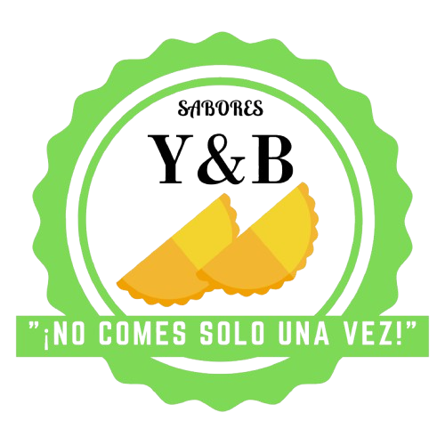

<div align="center">
  
  <h1>Sabores Y&B</h1>
  <p><strong>Las Mejores Empanadas Venezolanas y Bebidas Refrescantes</strong></p>
</div>

---

Bienvenido al repositorio oficial del proyecto Web de **Sabores Y&B**. Se trata de una landing page transaccional y catálogo de menú, optimizada para ventas locales y procesamientos de órdenes directamente por **WhatsApp**.

El sitio se enfoca en ofrecer la mejor experiencia de compra móvil (UX), contando con carrito de compras reactivo, integración en tiempo real del tipo de cambio (BCV), validaciones de disponibilidad del local y de horarios.

## 🚀 Características Principales

* **Responsive Design:** Orientado a Mobile-First para ofrecer a los clientes la mejor experiencia desde sus teléfonos.
* **Carrito Interactivo:** Lógica en Javascript puro que gestiona el subtotal, total e inventario de productos. 
* **Tasa BCV Dinámica:** Conectado directamente a la API de `DolarApi` para actualizar en tiempo real el precio de facturación final usando el convertidor a Bolívares.
* **Integración WhatsApp:** Auto-redacción del desglose del pedido (cantidades, detalles y tipos de moneda) en un mensaje formateado listo para ser enviado al comercio local.
* **Validación de Horario:** El sistema interactúa directamente con el reloj del cliente impidiendo que se cursen pedidos fuera del horario de atención laboral o durante días libres.

## 🛠️ Tecnologías Utilizadas

* **HTML5:** Estructura semántica simple, lista para SEO.
* **Tailwind CSS (CDN):** Estilo moderno, utilidad CSS avanzada y soporte rápido para prototipado.
* **JavaScript (Puro + jQuery):** Control del DOM, lógica del carro de compras y peticiones asíncronas para el BCV.
* **Google Fonts:** Tipografías vibrantes *Lilita One* (títulos) y *Outfit* (cuerpos de texto).
* **FontAwesome:** Iconografía y estética escalable.

## 📂 Estructura del Proyecto

```text
/
├── assets/                     # Todos los recursos estáticos del sistema
│   └── images/                 # Imágenes optimizadas para los productos
├── index.html                  # Catálogo de menú (Página Principal)
├── nosotros.html               # Historia y origen de la marca (Sobre nosotros)
└── README.md                   # Documentación principal
```

*Nota: La estructura mantiene explícitamente ambos archivos `.html` (`index` y `nosotros`) en la raíz del proyecto para cumplir con los estándares de indexado e interlinking habitual en plataformas simples de alojamiento como GitHub Pages o Vercel.*

## ⚙️ Cómo visualizar localmente

Solamente necesitas abrir o arrastrar el archivo `index.html` a cualquier navegador moderno (Google Chrome, Firefox, Edge, Safari), ya que se trata de un proyecto estático Front-end, ¡no requiere Node.js, PHP ni librerías compiladas locales para funcionar!

---

<div align="center">
  <p>Desarrollado con ❤️ para <b>Sabores Y&B</b>.</p>
</div>
